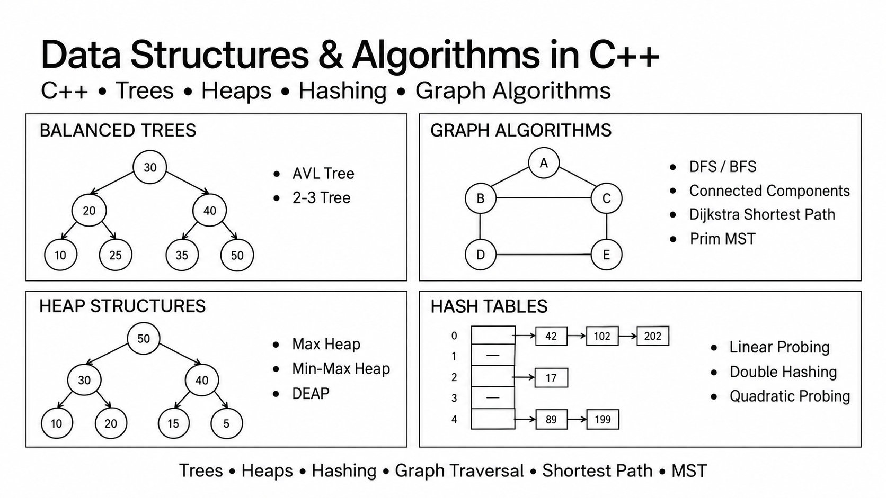

# Data Structures & Algorithms in C++

A collection of C++ implementations covering balanced trees, heap structures, hash-table collision strategies, graph traversal, shortest paths, connected components, and minimum spanning trees.



## Overview

This repository consolidates selected Data Structures coursework into a structured portfolio project.

Rather than relying on library implementations, the project focuses on manually implementing and applying fundamental data structures and graph algorithms in C++.

The main topics include:

- Balanced Trees — AVL Tree and 2-3 Tree
- Heap Structures — Max Heap, Min-Max Heap, and DEAP
- Hash Tables — Linear Probing, Double Hashing, and Quadratic Probing
- Graph Traversal — BFS and DFS
- Graph Analysis — Connected Components
- Shortest Path — Dijkstra's Algorithm
- Minimum Spanning Tree — Prim's Algorithm

The graph-related implementations are the most advanced part of the project, combining adjacency-list construction, traversal, weighted path computation, and MST analysis.

---

## Project Highlights

| Category | Implementations |
| --- | --- |
| Balanced Trees | AVL Tree, 2-3 Tree |
| Heap Structures | Max Heap, Min-Max Heap, DEAP |
| Hash Tables | Linear Probing, Double Hashing, Quadratic Probing |
| Graph Traversal | BFS, DFS |
| Graph Analysis | Connected Components |
| Shortest Path | Dijkstra's Algorithm |
| Minimum Spanning Tree | Prim's Algorithm |

---

# Graph Algorithms

The graph modules are the core part of this project.

Graphs are constructed using adjacency-list representations and processed using traversal and weighted-graph algorithms.

## BFS & DFS

Breadth-First Search and Depth-First Search are implemented to traverse graph structures and analyze connectivity.

```text
Graph
  ↓
Adjacency List
  ↓
BFS / DFS
  ↓
Connectivity Analysis
```

These implementations provided practical experience with:

- Graph representation
- Queue-based traversal
- Stack / recursive traversal logic
- Visited-node tracking
- Connectivity analysis

---

## Connected Components

DFS-based traversal is used to identify independent connected components within the graph.

Example concept:

```text
Component 1          Component 2

A ─── B              E ─── F
│   /                │
C                    G
```

Each component can then be processed independently by other graph algorithms.

---

## Dijkstra Shortest Path

Dijkstra's algorithm is implemented to compute shortest paths from a selected source node to other reachable nodes within the same connected component.

Core concepts include:

- Weighted adjacency lists
- Distance tracking
- Visited-node management
- Iterative minimum-distance selection

```text
Source Node
     ↓
Initialize Distances
     ↓
Select Minimum Distance
     ↓
Relax Adjacent Edges
     ↓
Shortest Path Results
```

---

## Prim Minimum Spanning Tree

Prim's algorithm is implemented to calculate the total cost of a Minimum Spanning Tree for connected graph components.

This required working with:

- Weighted edges
- Visited-node tracking
- Minimum-cost edge selection
- Connected-component processing

```text
Connected Component
        ↓
Choose Start Node
        ↓
Find Minimum Edge
        ↓
Expand Tree
        ↓
MST Cost
```

---

# Balanced Trees

## AVL Tree

The AVL Tree implementation maintains tree balance during insertion.

The implementation includes:

- Height calculation
- Balance checking
- Left and right rotations
- Automatic rebalancing after insertion

This project helped reinforce how self-balancing trees maintain efficient search and insertion behavior.

## 2-3 Tree

A 2-3 Tree implementation was also developed, including:

- Node insertion
- Multi-key node handling
- Node splitting
- Tree traversal

Working with both AVL and 2-3 Trees provided experience with two different approaches to maintaining balanced search structures.

---

# Heap Structures

Three heap-based structures were implemented:

### Max Heap

Maintains the maximum value at the root while preserving the heap property during insertion.

### Min-Max Heap

Alternates minimum and maximum levels to support efficient access to both extreme values.

### DEAP

Implements a double-ended heap structure for maintaining both minimum and maximum elements.

These implementations provided practice with:

- Array-based tree representation
- Parent / child index calculation
- Heap ordering
- Upward and downward adjustment

---

# Hash Tables

The project compares three open-addressing collision-resolution strategies.

## Linear Probing

```text
Hash(key)
   ↓
Occupied?
   ↓
Check next slot
```

## Double Hashing

Uses a second hash function to determine the probing step.

```text
index = h1(key) + i × h2(key)
```

## Quadratic Probing

Uses a non-linear probing sequence to reduce primary clustering.

The implementation provided practical experience with collision handling and the trade-offs between different probing strategies.

---

## Repository Structure

```text
data-structures-algorithms-cpp/
│
├── README.md
│
├── docs/
│   └── overview.png
│
└── src/
    ├── trees/
    │   └── balanced_trees.cpp
    │
    ├── heaps/
    │   └── heap_structures.cpp
    │
    ├── hashing/
    │   └── hash_table_probing.cpp
    │
    └── graph/
        ├── graph_traversal.cpp
        └── shortest_path_mst.cpp
```

---

## Implementation Summary

**Language:** C++

Main concepts used throughout the project:

- Dynamic data structures
- Tree traversal
- Tree balancing
- Heap ordering
- Hash collision resolution
- Queue and stack based traversal
- Adjacency-list graph representation
- Weighted graph algorithms
- Connected-component analysis

---

## What I Learned

This project helped strengthen my understanding of how common data structures and algorithms work internally rather than only using existing library implementations.

The most valuable part was progressing from individual data structures to graph problems that required multiple concepts to work together.

Through the project, I gained practical experience with:

- Choosing suitable data structures for different problems
- Translating algorithms into C++ implementations
- Managing dynamic and structured data
- Traversing and analyzing graphs
- Implementing weighted shortest-path and MST algorithms
- Debugging algorithm behavior with different input datasets

The project provided a stronger foundation for solving larger software-engineering and algorithmic problems in C++.
